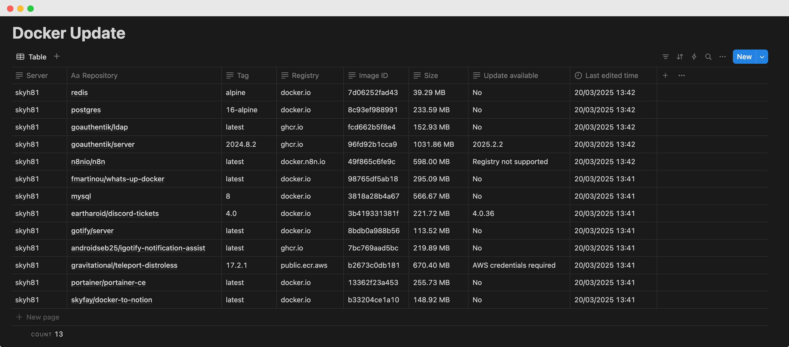
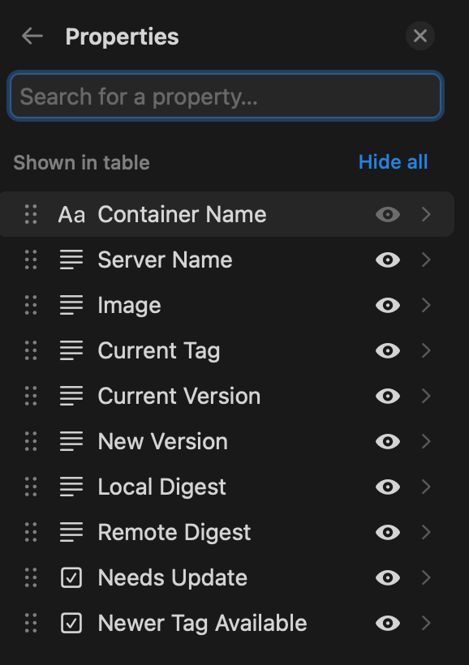
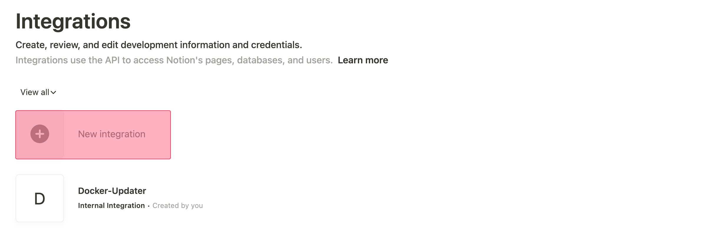
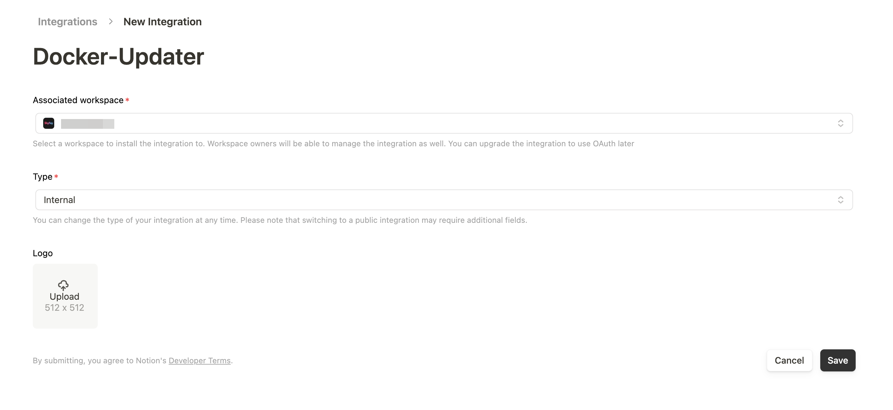
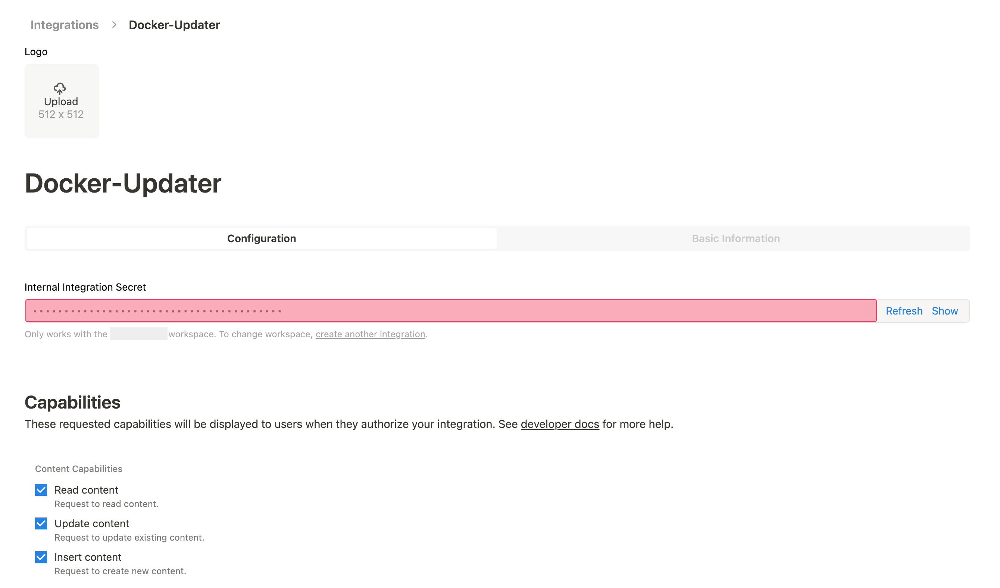
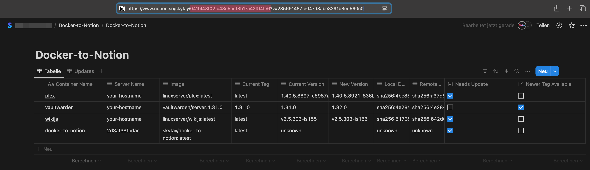
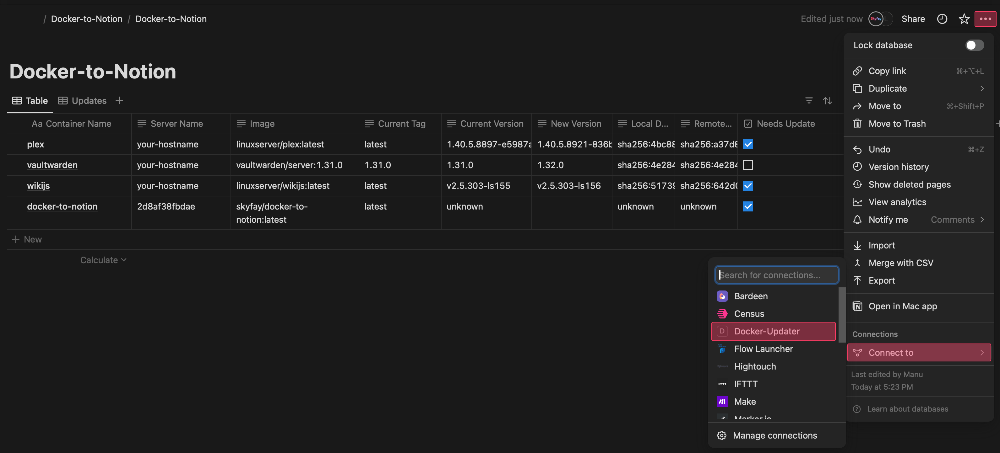

# Docker to Notion




Docker image updates visualized and centralized in Notion.

## Features ✨

- Get Images from the Docker Socket and send Updates to Notion
- Exclude Images
- Set a specific sync interval

## Usage 🐳

Via Docker Compose:

```yaml
version: '3.8'

services:
  app:
    image: skyfay/docker-to-notion:latest
    container_name: docker-to-notion
    hostname: your-hostname # Not needed if you use linux and /etc/hostname
    environment:
      - NOTION_API_KEY=your_notion_api_key
      - NOTION_DATABASE_ID=your_database_id
      - EXCLUDED_IMAGES=["skyfay/docker-to-notion"] # [] = exclude no images, ["image", "image2"] = exclude multiple images
      - SYNC_INTERVAL=3600  # the lowest value is 300 / 5 minutes

      # If you have images github container registry (ghcr)
      - GITHUB_TOKEN=your_github_token # https://github.com/settings/tokens only need read:packages permission

      # If you have images with aws container registry (ecr)
      - AWS_ACCESS_KEY=your_aws_access_key
      - AWS_SECRET_KEY=your_aws_secret_key
      - AWS_REGION='eu-central-1'
    volumes:
      - /var/run/docker.sock:/var/run/docker.sock
      - /etc/hostname:/etc/hostname:ro # Linux only instead use docker hostname above
    restart: unless-stopped
```

Via Docker CLI:

```bash
docker run -it --rm \
  --name docker-to-notion \
  -v /var/run/docker.sock:/var/run/docker.sock \
  -v /etc/hostname:/etc/hostname:ro \
  -e NOTION_API_KEY="your_notion_api_key" \
  -e NOTION_DATABASE_ID="your_database_id" \
  -e CHECK_INTERVAL=3600 \
  -e GITHUB_TOKEN="your_github_token" \
  -e EXCLUDED_IMAGES='["skyfay/docker-to-notion"]' \
  skyfay/docker-to-notion:latest
```

## FAQ 💬

### Create your Database in Notion

Create a Notion Database and add the following columns:



It doesn't matter in which order, but the names and types must match exactly.

Type     | Name
-------- | -------------------
Title    | Repository
Text     | Server
Text     | Tag
Text     | Registry
Text     | Image ID
Text     | Size
Text     | Update available

I recommend optionally adding “Last edited time” by Notion.

### How to get your Notion token?

First of all go to your Notion intigrations: <https://www.notion.so/profile/integrations>

1. Create a new intigration 

2. Add a intigration name, select your workspace and save 

3. Go to the intigration and copy your Notion Token = Internal Integration Secret 

### How to get the Notion database ID

Visit Notion via Web Browser: <https://www.notion.so/login>

1. Go to your Database and open it full screen and copy the database ID from your WEB URL 

2. Add the intigration you created to the notion database to give access 
